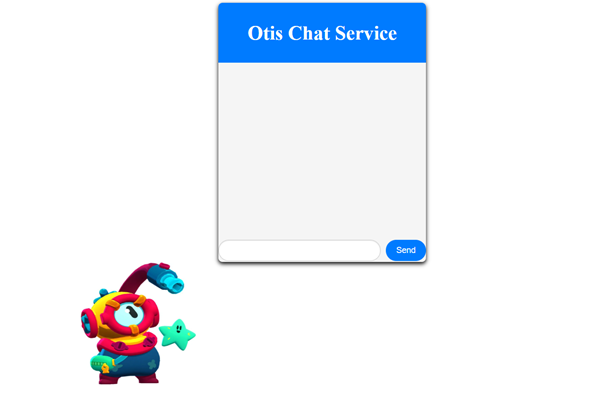

# Otis Chat Service

A real-time customer service chat application built with **Spring**, utilizing **WebSocket**

Otis is a character from my favorite mobile game, Brawl Stars. He was chosen as the project mascot because he conveniently looks right up at the chat UI.




## Key Features

- Real-time messaging
- Initial chat with Google's Gemini AI, prompted to provide service
- A UI built with HTML/CSS and JavaScript for API handling
- Switch button from AI to server-side chat


## WebSocket Endpoints

#### /app/message

```
Endpoint for which messages are sent to for client-server chatting
```


#### /app/ai-message

```
Endpoint for which messages are sent to for client-AI chatting
```


#### /switch
```
Endpoint for which the server knows when to switch off of Gemini AI
```

## WebSocket Subscription Topics

#### /topic/messages

```
Topic where clients are subscribed to receive chat messages
```


#### /topic/ai-message

```
Topic where clients are subscribed to receive AI chat messages
```


